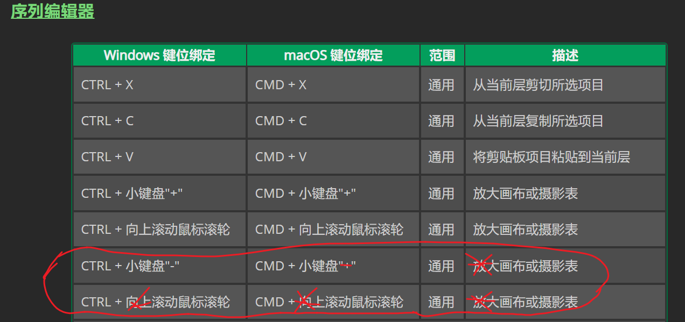

# 已知问题

## 文档

目前文档版本/Current Manual Version: 2023.2.0.60

此处均可归结为sbyoyo不认真导致难以顺利翻译 ~~有些甚至至今没修~~

### 1、physics_joint_prismatic_create 的参数 upper_trans_limit

> GML 代码 -> GML 代码参考 -> 物理 -> 关节 -> physics_joint_prismatic_create -> 参数 -> upper_trans_limit
> GML Code -> GML Code Reference -> Physics -> Joints -> physics_joint_prismatic_create -> Arguments -> upper_trans_limit

原因：描述与 lower_trans_limit 相同 (The lower permitted limit for the joint movement)

### 2、physics_joint_wheel_create 的参数 col

> GML 代码 -> GML 代码参考 -> 物理 -> 关节 -> physics_joint_wheel_create -> 参数 -> col
> GML Code -> GML Code Reference -> Physics -> Joints -> physics_joint_wheel_create -> Arguments -> col

原因：这里的类型应该是布尔值（Boolean），原意为是否可以碰撞 (true) 或不碰撞 (false)，但变成了颜色（Colour），然而其他同类函数却是对的

### 3. 序列编辑器的快捷键

> GameMaker IDE -> IDE 输入和导航 -> 键盘快捷键
> GameMaker IDE -> IDE Input And Navigation -> Keyboard Shortcuts

原因：见图
